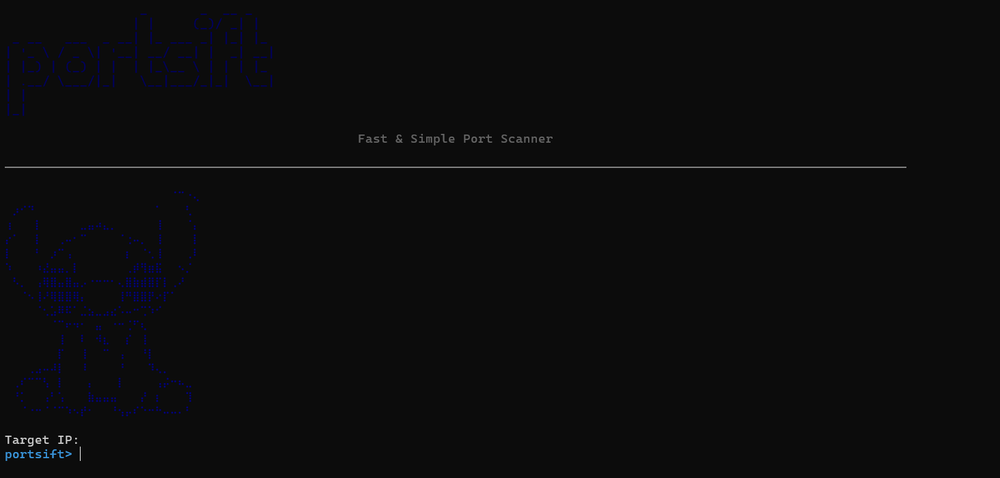

# portsift

## Preview

<div align="center">
  
</div>

A fast, lightweight and multi-threaded Python port scanner with a clean, terminal-friendly interface.

---

## 🚀 Features

* Multi-threaded port scanning
* Duplicate port filtering (avoids scanning the same port twice)
* Built-in IP validation
* Rich-based terminal output and ASCII banner
* Quick, full, and custom port scan modes
* Clear formatted results with service detection

---

## 📦 Installation

Clone the repository:

```bash
git clone https://github.com/tunakum/portsift.git
cd portsift
```

Install dependencies:

```bash
pip install -r requirements.txt
```

---

## ▶️ Usage

Run the scanner:

```bash
python main.py
```

The CLI will guide you through:

* Entering a target IP
* Selecting quick / full / custom scan
* Viewing found open ports in a formatted table

Example custom input:

```
21,22,80,443,445
```

(Any duplicate ports will be automatically removed.)

---

## 📁 Folder Structure

```
portsift/
├── cli/
│   ├── __init__.py
│   └── interface.py
│
├── scanner/
│   ├── __init__.py
│   ├── core.py
│   ├── ports.py
│   └── utils.py
│
├── main.py
├── requirements.txt
├── LICENSE
├── README.md
└── portsift.png
```

---

## 🛠️ Technologies & Libraries

### External:

* **pyfiglet** — ASCII banner generation
* **rich** — styled terminal UI & tables

### Built‑in:

* socket
* threading
* queue
* time

---

## 🔍 Port Service Detection

`scanner/ports.py` contains categorized service mappings such as:

* **Web Services** (80, 443, 8080, 8443...)
* **Databases** (3306, 5432, 27017...)
* **Mail Protocols** (25, 110, 143, 587...)
* **Remote Access** (21, 22, 23, 445...)
* **Network Services** (53, 67, 161...)

Unknown ports are displayed as:

```
Unknown
```

---

## ⚠️ Disclaimer

This tool is intended for **educational use** and for scanning systems you are **authorized** to test.
Unauthorized scanning may violate laws.
The author assumes no responsibility for misuse.

---

## 📄 License

This project is licensed under the **MIT License**. See the `LICENSE` file for details.

---

## 📬 Contact

Created by **tuna**.

For issues or suggestions, feel free to open a GitHub issue.

**LinkedIn:** [https://linkedin.com/in/tunahankum](https://linkedin.com/in/tunahankum)
